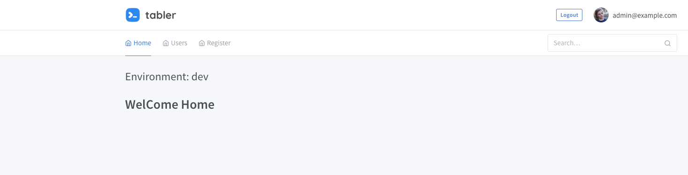

# Deploy GoLang Application with Argo

<!-- markdownlint-disable MD013 -->
Deploy GoLang example App on Kubernetes and CI/CD tools using Argoworkflow and ArgoCD

## Quick Start

### Install Dependencies

1. [Install Istio](Istio.md)

2. [Install Argoworkflow](Argoworkflow.md)

3. [Install Argocd](Argocd.md)

if Install finish you have this variables

```bash
export INGRESS_NODE_NAME=<you node name>
export INGRESS_NODE_IP=$(kubectl get nodes ${INGRESS_NODE_NAME} -o jsonpath='{ .status.addresses[?(@.type=="InternalIP")].address }')
export GITEA_NODE_NAME=<username>
export ARGOCD_PASSWORD=$(kubectl get pods -n argocd -l app.kubernetes.io/name=argocd-server -o name|grep -Po '/\K[\w-]+')
```

### Create docker registry secret

Replace the docker username password for yours.

```bash
kubectl create -n argo secret docker-registry regcred \
   --docker-server="https://index.docker.io/v1/"  \
   --docker-username=<your-name> \
   --docker-password=<your-pword>
```

### Start CI Pipelines

Clone code

```bash
# clone example code
git clone https://github.com/kuops/go-example-app ~/go-example-app/
```

Change workflow.yaml string

```bash
# replace docker image repo to your dockerhub repo/image:tag
sed -i 's@--destination=kuops/go-example-app@<your docker hub repo>@g'  ~/go-example-app/.argoworkflow.yaml
```

submit workflow

```bash
# running ci steps with argowrokflow,you can use -p revision=<commit> options change the default master value
argo submit -n argo --watch ~/go-example-app/.argoworkflow.yaml
```

Browser the workflow pipelines on `http://argo.{.INGRESS_NODE_IP}.nip.io`


Browser the pushed image on `https://hub.docker.com`

### Start Deploy The Applications

```bash
# create the deploy namespace
kubectl create ns dev
kubectl create ns stage
kubectl create ns prod
```

Create Deploy

```bash
argocd app create go-example-app --repo https://github.com/kuops/go-example-app.git --path deploy --dest-server https://kubernetes.default.svc --dest-namespace dev
```

Deploy the app

```
argocd app sync go-example-app --dry-run
argocd app sync go-example-app 
```

You Can use browser access `argocd.{.INGRESS_NODE_IP}.nip.io` check deploy status:


Create VirtualService

```
kubectl apply -f go-example-app/go-example-app/go-example-app-vs.yaml
```

Finally your can use browser access the user account is `admin@example.com` password `admin`:

- `go.app.dev.{.INGRESS_NODE_IP}.nip.io`
- `go.app.stage.{.INGRESS_NODE_IP}.nip.io`
- `go.app.prod.{.INGRESS_NODE_IP}.nip.io`


You can login index page show environment:




### Clenup

```
argocd app delete go-example-app
kubectl delete ns argocd
kubectl delete ns argo
```
