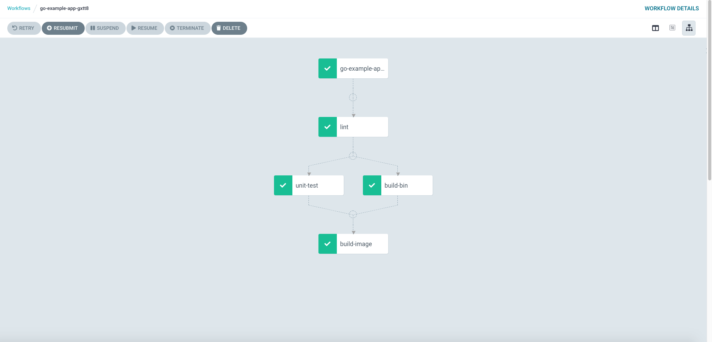

# Deploy GoLang Application with Argo

<!-- markdownlint-disable MD013 -->
Deploy GoLang example App on Kubernetes and CI/CD tools using Argoworkflow and ArgoCD

## Quick Start

### Create docker registry secret

Replace the docker username password for yours.

```bash
kubectl create -n argo secret docker-registry regcred \
   --docker-server="https://index.docker.io/v1/"  \
   --docker-username=<your-name> \
   --docker-password=<your-pword>
```

### Start CI Pipelines

submit workflow

```bash
# clone example code
git clone https://github.com/kuops/go-example-app
# replace docker image repo to your dockerhub repo/image:tag
sed 's@--destination=kuops/go-example-app@@g'  go-example-app/.argoworkflow.yaml
# running ci steps with argowrokflow,you can use -p revision=<commit> options change the default master value
argo submit -n argo --watch go-example-app/.argoworkflow.yaml
```

Browser the workflow pipelines on `http://argo.{.INGRESS_NODE_IP}.nip.io`



Browser the pushed image on `https://hub.docker.com`

### Start Deploy The Applications

```bash
# create the deploy namespace
kubectl create ns dev
kubectl create ns stage
kubectl create ns prod
```

Create Deploy

```bash
argocd app create go-example-app --repo https://github.com/kuops/go-example-app.git --path deploy/dev --dest-server https://kubernetes.default.svc --dest-namespace dev
```

Test, Change ip to your pod ip test secret

```bash
curl --header "Content-Type: application/json"   --request POST   --data '{"name":"xyz"}'   http://192.168.102.76:8080/api/hello
```

result use browser access:


