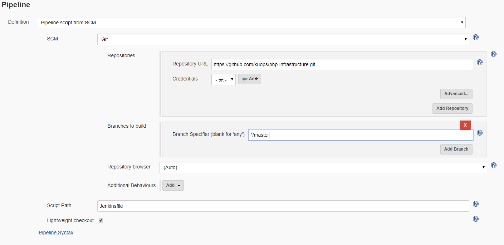
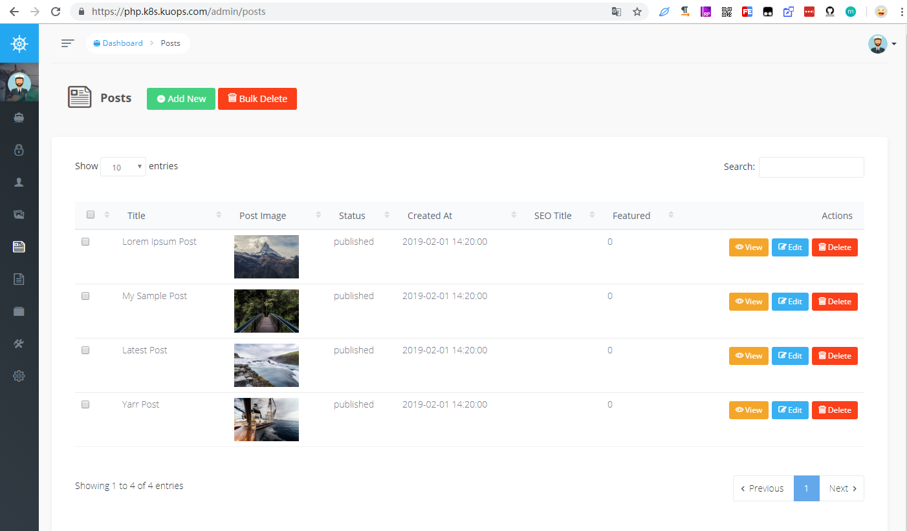

php code repo 开发者使用，在仓库的 ci 文件夹存放 用于 CI 的 Jenkinsfile ,示例地址: 

```
https://github.com/kuops/php-example-app.git
```

php deploy repo 运维人员使用, 仓库地址:

```
https://github.com/kuops/php-infrastructure.git
```

将这两个仓库 fork 到你自己的仓库下面

### php ci

由于使用私有地址，无法使用 webhook 回调，不能使用 pull requirest 触发构建，这里使用 pollSCM 触发构建

```
 triggers {
        pollSCM('*/2 * * * 1-5')
    }
```

修改 pipeline 中的 REGISTRY_URL 为你的地址:

```
environment { 
        REGISTRY_URL = 'docker.k8s.yourdomain.com'
    }
```

首先, 我们创建一个用于存放 composer cache 的 volume, 这个 volume 用于 Jenkins 的 slave 启动

```
kubectl apply -f https://raw.githubusercontent.com/kuops/php-infrastructure/master/composer/pvc.yaml
```

接下来我们创建 CI job `php-ci`,类型为 Pipeline , 按照以下设置 Jenkins , Jenkinsfile 路径为 `ci/Jenkinsfile`


配置完成之后点击构建，就开始执行 CI 操作了。


### php cd 

部署之前我们还需要一个 https 证书，在 php-infrastructure 中将 https 证书修改 voyager/template/secret.yaml

```
apiVersion: v1
data:
  tls.crt: <your_cert>
  tls.key: <key_key>
kind: Secret
metadata:
  name: php-tls-certs
type: kubernetes.io/tls

```

设置 dev 空间拉去镜像 secret

```

kubectl -n dev create secret docker-registry regcred \
    --docker-server=docker.k8s.yourdomain.com \
    --docker-username=admin --docker-password=admin123
```

设置 jenkins cd job `php-cd` pipeline 类型,设置如下：



构建完成之后访问 `https://php.k8s.yourdomain.com/admin`

用户名: `admin@admin.com` , 密码: `password`


