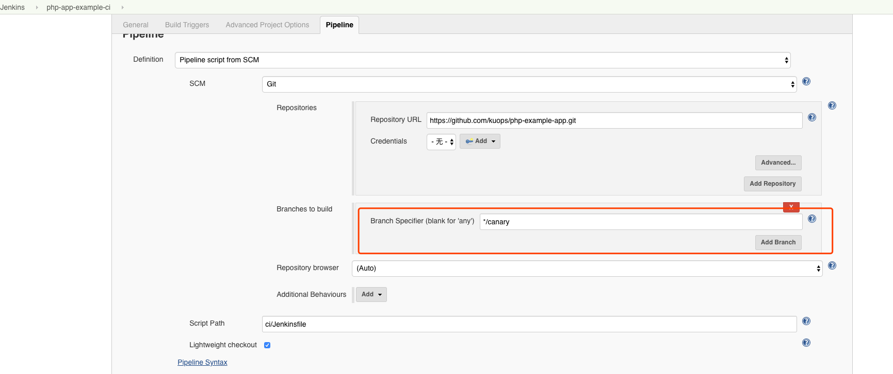
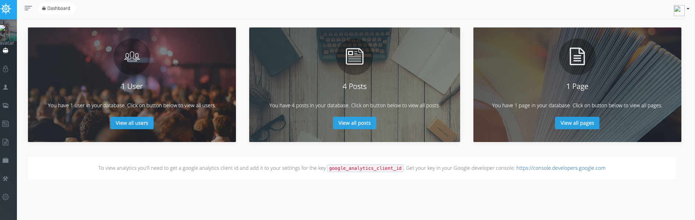
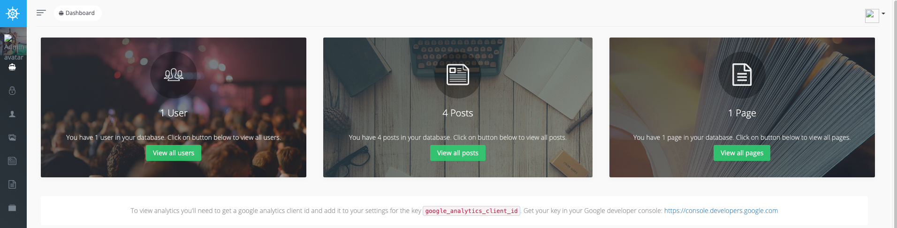

# Deploy PHP Application with Jenkins

<!-- markdownlint-disable MD013 -->
Deploy PHP example App on Kubernetes and CI/CD tools using Jenkins And Helm

## Quick Start

### Install Dependencies

1. [Install Jenkins](Jenkins.md)


### CI

Create Docker Regisgtry secret.

```bash
kubectl create -n jenkins secret docker-registry regcred \
   --docker-server="https://index.docker.io/v1/"  \
   --docker-username=<your-name> \
   --docker-password=<your-pword>
```

Using Jenkins CI build php app, The Jenkins Project Settings:


But Fist Build Can Failed, Beacuse You Dont have Build Parameter:


Then retry it, the parameters is working, Chane parameter to your repos:


Then build the `master` and `canary` branch and push image,finally have two image:



- `kuops/php-example-app:master`
- `kuops/php-example-app:canary`

### CD 

Deploy temporary mysql,not have volume

```bash
kubectl apply -f mysql/mysql.yaml
```

Create Deploy Serviceaccount

```bash
kubectl create clusterrolebinding jenkins-deploy --clusterrole=cluster-admin --serviceaccount=jenkins:example-jenkins
```

Create jenkins project `php-app-example-cd`

Change virtualservice `{.INGRESS_NODE_IP}` to your ingress ip, Change weight to control canary deploy

```bash
    route:
    - destination:
        host: blue-voyager
        port:
          number: 80
      weight: 100
    - destination:
        host: green-voyager
        port:
          number: 80
      weight: 0
```

the blue version:



Change Green version:

```bash
    route:
    - destination:
        host: blue-voyager
        port:
          number: 80
      weight: 0
    - destination:
        host: green-voyager
        port:
          number: 80
      weight: 100
```

the green version:


