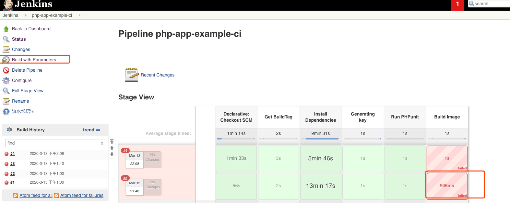

# Deploy PHP Application with Jenkins

<!-- markdownlint-disable MD013 -->
Deploy PHP example App on Kubernetes and CI/CD tools using Jenkins And Helm

## Quick Start

### Install Dependencies

1. [Install Jenkins](Jenkins.md)


### CI

Create Docker Regisgtry secret.

```bash
kubectl create -n jenkins secret docker-registry regcred \
   --docker-server="https://index.docker.io/v1/"  \
   --docker-username=<your-name> \
   --docker-password=<your-pword>
```

Using Jenkins CI build php app, The Jenkins Project Settings:


But Fist Build Can Failed, Beacuse You Dont have Build Parameter:



Then retry it, the parameters is working, Chane parameter to your repos:


### CD 

Deploy temporary mysql ，not have volume

```bash
kubectl apply -f mysql/mysql.yaml
```
