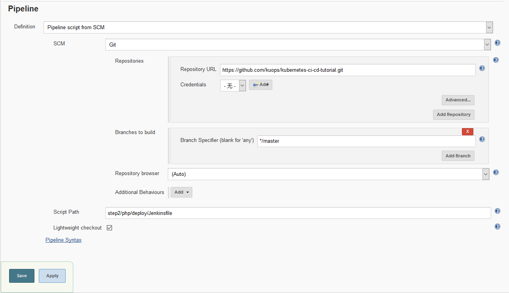

## kubernetes-ci-cd-tutorial


### 环境准备

1.  Kubernetes 集群, 如果没有可以使用 `https://github.com/kuops/Scripts/tree/master/vagrant/kubeadm` 创建集群
2.  安装 `Helm` 和 `Tiller`
3.  安装 ingress
4.  有一个 `storageclass`


### step 1 

准备 `nexus` 和 `jenkins`

```
helm upgrade --install myjenkins step1/jenkins/
helm upgrade --install mynexus step1/sonatype-nexus/
```

配置 nexus 仓库，添加 docker(hosted) 仓库

https://github.com/travelaudience/kubernetes-nexus/blob/master/docs/admin/configuring-nexus.md

创建 Private Registry Secret

```
kubectl create secret docker-registry regcred --docker-server=docker.k8s.kuops.com --docker-username=<your-name> --docker-password=<your-pword> --docker-email=<your-email>
```

### step 2

- PHP demo 使用 `https://github.com/kuops/php-example-app.git`

创建 composer 缓存 pvc

```
kubectl  apply  -f step2/php/composer/pvc.yaml
```

使用 Jenkins 创建  php-example-app-ci Job，用来打包镜像，并上传至 nexus 


使用 Jenkins 创建  php-example-app-cd Job，用来部署 lavael app 




部署完毕, 访问 voyager:

```
curl http://laravel.k8s.kuops.com/admin
```

用户名: `admin@admin.com` , 密码: `password`


